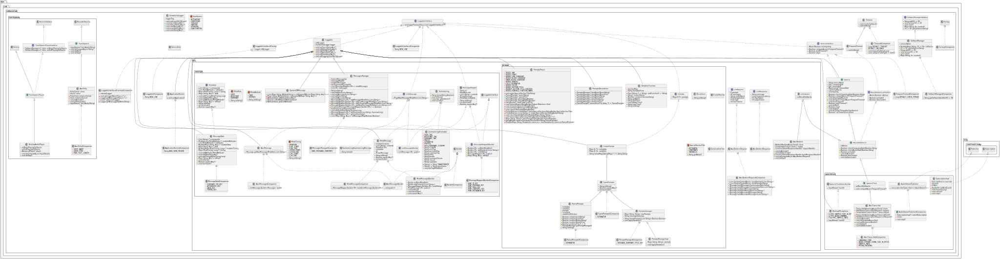

# Call Assistant Backend

A Kotlin-based backend that drives LLM-based phone conversations with a human.

It is meant to be a base to interface to implement secretary
assistants for small companies and freelancers. For instance, 
we assume that the user calls a freelancer to an Andorid 
device, which allows the receiver to redirect calls to a VOIP
number, where the virtual assistant will ask for the reason
of the call. The objective of the assistant is to collect 
information from the user and return them to the freelancer.

This project implements the backend of a call assistant 
system, which is based on AWS services including 
[Bedroock](https://docs.aws.amazon.com/sdk-for-java/latest/developer-guide/java_bedrock-runtime_code_examples.html),
[Transcribe](https://aws.amazon.com/pm/transcribe/), and
[Polly](https://aws.amazon.com/polly/).
However, the implemented backend abstracts the three AWS 
services (i.e., **LLM**, **Speech-To-Text** and 
**Text-To-Speech**, respectively), such that these 
functionalities do not strictly need to be based on AWS 
Kotlin API. Nonetheless, the implementation has some 
missing features (addressed at the end of this file), which 
need to be addressed. The more evident limitation is that this
backend lack of the ability to store conversation logs and 
provide the summary of it to the freelancer.


## Software Components

This backend architects the tree AWS services through **packages**, 
which are:
 - [text2speech/](src/main/kotlin/cubibon/callAssistant/speech2text/)
   (more on the package [documentation](doc/wiky/TEXT_2_SPEECH.md)):  
   Implements the interface that takes audio to streams and returns 
   string with metadata by invoking streaming WEB services. 
 - [speech2text/](src/main/kotlin/cubibon/callAssistant/text2speech),
   (more on the package [documentation](doc/wiky/SPEECH_2_TEXT.md)):  
   Implements the interface that takes strings and plays an audio 
   stream based on streaming WEB services.
 - The [llm/](src/main/kotlin/cubibon/callAssistant/llm) package
  ([documentation](doc/wiky/LLM.md))  is divided in 
   two sub-packages:
   - [llm.message/](src/main/kotlin/cubibon/callAssistant/llm/message) 
     (more on the [documentation](doc/wiky/LLM_MESSAGE.md)):  
     Interfaces text-to-speech and speech-to-text to LLM based messages 
     (i.e., `role` as `USER` and `ASSISTANT`).
   - [llm.prompt/](src/main/kotlin/cubibon/callAssistant/llm/prompt)
     (more on the [documentation](doc/wiky/LLM_PROMPT.md)):  
     Implements a simple syntax (based on placeholder) to dynamically 
     generate prompts for the LLM. 
 - [dialogue/](src/main/kotlin/cubibon/callAssistant/dialogue)
   (package ([documentation](doc/wiky/DIALOGUE.md)):    
   Orchestrates the dialogue between the user and assistant based on 
   the above packages and a finite state machine.  
   Note that this is the last part that was developed, and it requires
   further testing and development.
 - [ServiceInterface.ky](src/main/kotlin/cubibon/callAssistant/ServiceInterface.kt)
   [documentated here](doc/wiky/SERVICE.md)):  
   Provides a base interface for WEB services, and it is use 
   by all the package above.
 - [Loggable.kt](src/main/kotlin/cubibon/callAssistant/Loggable.kt)
   (package [documentated here](doc/wiky/LOGGABLE.md)):  
   Provides a logging abstraction.

The code is detailed documented through Dokka, and the HTML version is 
[available here](doc/dokka/). Also, this repository provides UML diagrams
of all the packages, and their are [available here](doc/uml).




## Installation and Run
 
The software is based on Kotlin 1.9.24 and Groovy 3.0.22, and the 
software can be build with `.\gradlew`.

To run one of the [available tests](src/test/kotlin/cubibon/callAssistant) 
you can use
```
./gradlew :test --tests "com.project.package.TestFile.testFunctionName"
``` 
where `testFunctionName` can be omitted if you want to run all the 
tests functions in the `TestFile`.

To run the main entrypoint use on developing use 
```
./gradlew run
```
while on production 
```
./gradlew run -Pprod
```

Note that we used the Gradle `application` plugin to define the global 
`main` function, which is located on the [cubibon.callAssistant.ApplicationRunner](src/main/kotlin/cubibon/callAssistant/ApplicationRunner.kt) 
class.


## Configuration files

Configurations are given through `*.env` files, which are also used in [build.gradle.kts](build.gradle.kts) for checking
at compile time if all the configurations are provided. This requires to add the path to all configurations files in the
`environmentFiles` list defined in [build.gradle.kts](build.gradle.kts). Note, that such a check is not done in a 
product environment tom minimize latency on cold start.

As defined in [build.gradle.kts](build.gradle.kts) there exist `OPTIONAL` and `REQUIRED` environmental variables. The
former have a default value, while the latter must be explicitly defined for making this project run.

### Environmental Variables Files:

Configuration file should be used in order to provide environmental variables. Such files contain a list of bash-based
variable in the form `VAR_NAME=STRING_VALUE\n`. Note that it is commanded to do not introduce white spaces or comments
in the same line where a variable has been defined.

There are different scenarios where it is possible to load environmental variables at running time:

 - When running from the terminal, [build.gradle.kts](build.gradle.kts) is charge to set environmental variables for  
   through the `tasks.withType<JavaExec>` task. This words for Unit tests and for develop/product runs as well (e.g.,
   when a `main` function runs) 

 - When running from IntelliJ IDEA, we should differentiate testing and develop/product runs. For Unit tests, 
   environmental variables are retrieved through [build.gradle.kts](build.gradle.kts), as when the software runs from 
   terminal. Instead, when a `main` function is executed, then the 'EnvFile' IntelliJ plugin is required. Such a plugin 
   has to be configured from the running configurations such to enable the `*.env` files from the dedicated tab.


### Logging Configuration:

This project uses the `slf4j` logging framework with the `log4j2` concrete implementation, which allow for asynchronous
logger and integration with AWS Lambda functions. 

In particular, we define a `logger` for each Kotlin package, which level is specified in the 
 [log_config.env](src/main/resources/log_config.env) file, and further configuration are defined i the 
[log4j2](src/main/resources/log4j2.xml) file.

It follows a list of `OPTIONAL` environmental variables for logging purposes, where possible values are: `ALL`, `TRACE`, 
`DEBUG`, `INFO`, `WARN`, `ERROR`, or `OFF`.

 - `BASE_PKG`: The base package of this project, by default is `cubibon.callAssistant`.
 - `BASE_PKG_AWS`: The base package of AWS dependencies, by default is `software.amazon.awssdk`.


 - `LOG_LEVEL_ROOT`: The root logging level, by default it is `INFO`.

 - `LOG_LEVEL_AWS`: The general log level for AWS services; default is `WARN`.
 - `LOG_LEVEL_AWS_TRANSCRIBE`: The log level for AWS Transcribe service (i.e., speech-to-text); default is `WARN`.
 - `LOG_LEVEL_AWS_POLLY=WARN`: The log level for AWS Polly service (i.e., text-to-speech); default is `WARN`.
 - `LOG_LEVEL_AWS_BEDROCK=WARN`: The log level for AWS Bedrock service (i.e., LLM inferences); default is `WARN`.


 - `LOG_LEVEL_PKG_LLM`: The log level for the `${BASE_PKG}.llm` package; default is `WARM`.
 - `LOG_LEVEL_PKG_LLM_PROMPT`: The log level for the `${BASE_PKG}.llm.prompt` package; default is `WARM`.
 - `LOG_LEVEL_PKG_LLM_MESSAGE`: The log level for the `${BASE_PKG}.llm.message` package; default is `WARM`.
 - `LOG_LEVEL_PKG_SPEECH2TEXT`: The log level for the `${BASE_PKG}.speech2text` package; default is `WARM`.
 - `LOG_LEVEL_PKG_TEXT2SPEECH`: The log level for the `${BASE_PKG}.text2speech` package; default is `WARM`.
 - `LOG_LEVEL_PKG_DIALOGUE`: The log level for the `${BASE_PKG}.dialogue` package; default is `WARM`.
 - `LOG_LEVEL_PKG=TRACE`: The log level for the `${BASE_PKG}` package (this includes the `main` function); default is 
   `WARM`.


### AWS Configuration:

There also are `REQUIRED` environmental variables related to AWS services. These variables are collected in the 
[aws_config.env](src/main/resources/aws_config.env) file, which should not be synchronised with Git since it contains
sensitive information. Here it follows the list of required variables

 - `AWS_REGION`: The region used for the AWS services, e.g., `eu-central-1`.
 - `AWS_ACCESS_KEY_ID`: The access key given by AWS.
 - `AWS_SECRET_ACCESS_KEY`: The secret key given by AWS.
 - `AWS_SESSION_TOKEN`: The session token given by AWS.


 - `AWS_TRANSCRIBE_LANGUAGE`: The language for speech-to-tex service based on AWS Transcribe, e.g., `it-IT`, see 
   the [list of supported languages](https://docs.aws.amazon.com/transcribe/latest/dg/supported-languages.html).
 - `AWS_TRANSCRIBE_AUDIO_STREAM_CHUNK_SIZE`: The buffer size in byte of the audio signal for speech-to-text conversion
    as an integer; recommended value, `1024`. It is suggested to set it as 
    `chunk_size_in_bytes = chunk_duration_in_millisecond / 1000 * audio_sample_rate * 2`, for more info check 
    [this web page](https://docs.aws.amazon.com/transcribe/latest/dg/streaming.html).


 - `AWS_POLLY_VOICE_NAME`: The name associated with a Polly's voice for text-to-speech, e.g., `Bianca`, see the 
   [list of supported voices](https://docs.aws.amazon.com/polly/latest/dg/available-voices.html).
 - `AWS_POLLY_VOICE_TYPE`: The type of Polly's voice for text-to-speech. It can either be `standard`, `neural`, 
   `long-form` or `generative`. Note that not all the voice names has all the types (see link above), and that prices do
   change based on voice type; also, voice names and types might change based on different AWS regions.


 - `AWS_BEDROCK_MODEL_NAME`: The name of the LLM models, which should be available in the chosen AWS region and enabled
   for the used account, e.g., `anthropic.claude-3-haiku-20240307-v1:0`.
 - `AWS_BEDROCK_MAX_TOKENS`: The maximum number of tokens generated by the LLM model as an integer, e.g., `512`. After 
   such limit, the Bedrock response will be pronated. 
 - `AWS_BEDROCK_TEMPERATURE`: The temperature associated with the LLM model managed by Bedrock, it should be a float in
   `[0,1]`. The higher the temperature is, the more creative and unpredictable the responses will be, while lower 
   temperatures make the outputs more deterministic and focused on higher-probability options.
 - `AWS_BEDROCK_TOP_P`: The top-p value (also known as nucleus sampling) should be a float in [0,1]. The higher this 
   value is, the more diverse and potentially creative the responses will be, as the model considers a wider range of 
   tokens from the probability distribution. For example, a value of 0.9 means the model will consider tokens from the 
   top 90% of the probability distribution, while a value of 0.1 will only consider the most likely tokens that make up 
   the top 10% of the probability distribution, resulting in more focused and deterministic outputs.


## Current Limitation

Currently the backend still does not:
 - manage the dialogue properly (the current implementation is only a Proof of Concept),
 - produce a report of the call and save them into a DB,
 - has an LLM messages structure that can be further simplified,
 - has limited reaction to errors,
 - doe not implement a proper running mechanism for production,


---

**Author**: Luca Buoncompagni © 2025.,  
**License**: AGPL-3.0 license,  
**Version**: 1.0,

