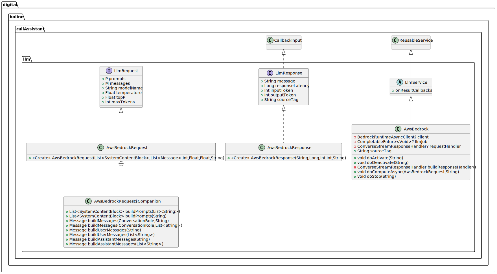

# LLM Interaction

The interface to interact with an LLM model exploits the [Service Interface](SERVICE), which provides 
asynchronous usage of a WEB-based provider for having LLM-based response. As an example, we provide an implementation 
based on the AWS Bedrock service.

## Software Architecture

As shown in the UML diagram below, the LLM-based interaction is interfaced by 
`LlmService<I: LlmRequest<*, *>, O: LlmResponse>`, where `LllmRequest<P,M>` and `LlmResponse` are data classes that 
contains specific data for each LLM provider.

In particular, `LlmRequest` encompasses: system prompts, user and assistant messages, the LLM temperature, the LLM
top-probability and the max number of token that the LLM can provide. While `LlmResponse` involves: the LLM response
message, the computation latency, the number of input and output tokens.

# AWS Bedrock

`AwsBedrock` extends the `LlmIntreract` class to be used with AWS-based LLM through the `AwsRequest` and `AwsResponse`
classes that implements the `LlmRequest` and `LlmResponse` respectively.

`AwsBedrock` requires the following environmental variables (see the [README](../../README.md) for more info about
environmental variables): `AWS_REGION`, `AWS_ACCESS_KEY_ID`, and `AWS_ACCESS_KEY_ID`. While the `AwsRequest` initialize
some of its fields based on the environmental variables: `AWS_BEDROCK_MAX_TOKENS`, `AWS_BEDROCK_TEMPERATURE`, 
`AWS_BEDROCK_TOP_P` abd `AWS_BEDROCK_MODEL_NAME`.

It follows an example on how to use `AwsBedrock`

```kotlin
      val bedrock = AwsBedrock()

      // Set the callback for errors within AwsBedrock.
      bedrock.onErrorCallbacks.add { se: ServiceError ->
          println("Got LLM Bedrock error: ('${se.source}', ${se.sourceTag}) ${se.throwable}")
      }

      // Set the callback for results within AwsBedrock.
      bedrock.onResultCallbacks.add { response: AwsBedrockResponse ->
          println("Got LLM Bedrock response: $response")
      }

      // Initialize the AWS Bedrock service.
      bedrock.activate()

      // Define the request to the LLM model.
      val prompts: List<SystemContentBlock> = AwsBedrockRequest.buildPrompts("My prompt")
      val message: Message = AwsBedrockRequest.buildMessages(ConversationRole.USER,"My message")
      // Note that `request` allow defining other parameter (e.g., temperature, top_p, etc.)
      val request: AwsBedrockRequest = AwsBedrockRequest(prompts, listOf(message))
      // Optionally define a computation timeout (which is reset every time a part of the LLM response is received).
      val timeoutSpec = FrequentTimeout(200, 20) {
          println("Time out occurred!")
      }
      // Make the request to the LLM model
      bedrock.computeAsync(request, timeoutSpec, "MySourceTag")

      // Wait for the response from the LLM model with an optional timeout.
      val waitTimeout = Timeout(20000) { sourceTag ->
          println("Waiting timeout occurred! ($sourceTag)") 
      }
      bedrock.wait(waitTimeout, "MyTimeoutSourceTag")
      // Or stop the computation.
      bedrock.stop()

      // Eventually, make new computations...

      // Finally, always remember to release the AWS Bedrock resources when it is no longer needed.
      bedrock.deactivate()

      // You might want to `activate` the Bedrock service again and start new computation.

      // Cancel the scope and all related jobs. After this the service cannot be activated again.
      bedrock.cancelScope()
```



For more info see the [Service Interface](SERVICE).  
For more implementation details check out the
[documented code](../dokka/html/-call-assistant--brain/cubibon.callAssistant.llm/index.html).  
For more examples checkout
[DummyLlmService.kt](../../src/test/kotlin/cubibon/callAssistant/llm/DummyLlmService.kt) and
[AwsBedrockRunner.kt](../../src/test/kotlin/cubibon/callAssistant/llm/AwsBedrockRunner.kt).

---

**Author** Luca Buoncompagni.  
© 2025.