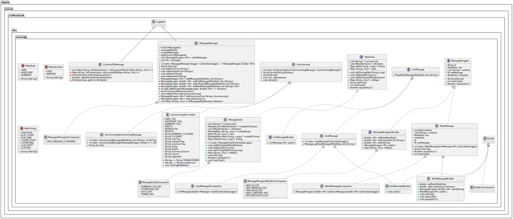

# LLM-Based Messaging

When a user interacts with an LLM model, messages are exchanged between the user and an assistant. Each `message` has 
two typical characteristics
 - a `role`, which is an enumerator representing who generate the specific message, and it can either be `USER` or
   `ASSISTANT`. Usually, the messages should always have alternating roles, and the first message should come from the 
   user.
 - some `contents`, which encompass textual strings, images, sound, video etc. In this project we only assume to have
   text-based contents and, for generality, we consider them to be a list of strings.

LLM models are stateless and, to keep the context of the conversation, all previous messages as to be sent to the 
virtual assistant each time. This makes the list of messages growing over time, which is not efficient and costly since
the number of tokens exchanged with the LLM increases over time. To reduce costs and improve performances, we 
implemented a summarization approach that reduces all the previous message in a single message.

This objective of this package are
 - maintain lists of messages over time to support the conversation between the user and the LLM-based assistant,
 - implement a summarization approach to reduce costs and improve performances,
 - provide a general implementation of the previous two point, which does not depend on the current LLM model used.
 - maintain a log of all the exchanged messages and summarization for logging purposes into a NoSQL DB.


## General Architecture and Datastructures

This package is divided in the following files
 - [MessageInterface.kt](../../src/main/kotlin/digital/boline/callAssistant/llm/message/MessageInterface.kt), which 
   contains the base classes for this implementation, i.e.,
   - `MetaRole`: is an enumerator describing the role of the message, such as `USER` and `ASSISTANT`, and the `SUMMARY`
     tag.
   - `LlmMessage`: is an interface for messages for a general LLM provider.
   - `MetaData`: which implements a structure of data to be associated with each message for logging purposes.
   - `MetaAttribute` and `MetaTiming`: are enumerators used to structure data in the `MetaData`.
   - `MessageWrapper`: is an interface to represent a general message, which include an identifier, some metadata, a 
     message role, and some message contents (as a `List<String>`). This class is the base message representation and 
     can be used to obtain references to `LlmMessage`, `MetaData`.
 - [MetaMessage.kt](../../src/main/kotlin/digital/boline/callAssistant/llm/message/MetaMessage.kt), which implements the
   interfaces introduced above that are not related to specific LLM providers. In particular, it includes:
   - `MessageData`, which implements the `MetaData` interface, and exploits `MetaAttributes` and `MetaTiming`.
   - `MetaMessage`, which implements the `MessageWrapper` interface, and uses the `MetaData` class.
 - [AwsMessage.kt](../../src/main/kotlin/digital/boline/callAssistant/llm/message/AwsMessage.kt), which encompass
   implementations related to Bedrock-based LLMs provided by AWS. It includes:
   - `AwsMessage`, which implements the `LlmMessage` interface for AWS.
   - `DynamoDBMessage`, which converts maps representing messages into a data structure that can be store in the AWS
     Dynamo DB.
   - `buildAwsMessagesManager` and `buildAwsMetaMessage`, which are helping functions that respectively get instances of 
     the `MessagesManager` (see below) to be used for AWS Bedrock, and `MessageWrapper` based on `AwsMessage` for 
     testing purposes.
 - [MessagesManager.kt](../../src/main/kotlin/digital/boline/callAssistant/llm/message/MessagesManager.kt), which is the
   entry point for this implementation. It contains:
   - `MessagesManager`, which manages a list of `MessageWrapper` implementation, see below for more information.
   - `Summarizing`, which is a data class useful during the summarization process explained below.

   


### Message Interface

`MessagesManager` is main class of this implementation, and it has been design to maintain a list of messages over time.
For being general with respect to different LLM provider, it wraps `LlmMessage` into a `MessageWrapper`, which basic
implementation is given by `MetaMessage`. For this reason, `LlmMessage` and `MessageWrapper` exploit a nested factory 
paradigm, where `MetaMessage` can instance specific `MessageWrapper` implementations which, in turn instantiates 
specific implementation of `LlmMessage`. To allow such a paradigm, both `MessageWrapper` and `LlmMessage` implement a 
`Builder` inner class, which is also exploited to decouple properties meant to be accessible only within 
`MessagesManager` from properties publicly available (for more information, see 
[the documented code](../dokka/html/-call-assistant--brain/digital.boline.callAssistant.llm.message/index.html) 
of `MessagesManager`, `LlmMessage`, `LlmMessage.Builder`, `MessageWrapper`, and `MessageWrapper.Builder`). 

Within this paradigm, the basic implementation of the an `LlmMessage`, and related instantiation can be for instance:
 ```kotlin
// import `LlmMessageProvider` which is the message class required by a specific LLM provider
 
class MyLlmMessage private constructor() : LlmMessage<LlmMessageProvider> {
   
   ... // Implement here publicly available functionalities.

   private inner class Builder : LlmMessage.Builder<LlmMessageProvider> {
   
        override fun public() = this@MyLlmMessage
        
        ... // Implement here functionalities accessible only within `MessagesManager`.
   }

   companion object {
   
      // Implementation of the factory paradigm.
      fun build(): LlmMessage.Builder<Message> = MyLlmMessage().Builder()
   }
}
 
// Create a new instance.
val message : MyLlmMessage.Builder  = MyLlmMessage.build()

// Get a reference to the public object.
val publicMessage : MyLlmMessage = message.public()
```

Similarly, the basic implementation of a `MessageWrapper`, and relate instantiation, can be:
```kotlin
// import `LlmMessageProvider` which is the message class required by a specific LLM provider

class MyMetaMessage private constructor(private val llmMessage: LlmMessage<LlmMessageProvider>) : MessageWrapper<LlmMessageProvider> {

   ... // Implement here publicly available functionalities

   private inner class Builder : MessageWrapper.Builder<M> {
   
      override fun public(): MyMetaMessage = this@MyMetaMessage 

      ... // Implement here functionalities accessible only within `MessagesManager`.   
   }

   companion object {
   
      // Implementation of the factory paradigm.
      fun <M> build(llmMessageBuilder: LlmMessage.Builder<LlmMessageProvider>): MessageWrapper.Builder<LlmMessageProvider> =
         MyMetaMessage(llmMessageBuilder.public()).Builder()
   }
}

// Create a new instance.
val messageWrapper : MyMetaMessage.Builder  = MyMetaMessage.build(MyLlmMessage.build())

// Get a reference to the public object.
val publicMessageWrapper : MyMetaMessage = messageWrapper.public()

// Get the reference to the encoded `LlmMessage`.
val myLlmMessage: MyLlmMessage = publicMessageWrapper.rawMessage
```
Note that `MessageWrapper` contains a reference to `LlmMessage`, so it is not required to directly instantiate 
`LlmMessage` object (for instance see the `buildAwsMetaMessage` function, which also show how to set the properties of
a `MessageWrapper` implementation).


Therefore, a `MessagesManager` can be instantiated by giving the `MessageWrapper` and `LlmMessage` factories as:
```kotlin
val manager: MessageManager = MessagesManager { MyMetaMessage.build(MyLlmMessage.build()) }
```
This allows `MessagesManager` to create instances of `MyMetaMessage` (which encodes instances of `MyLlmMessage`) at run
time.


### Messages Manager

`MessagesManager` manges a list of `MessageWrapper` that represents the dialogue between the user and an LLM-based
assistant. Such a list is internally managed as a mutable list (i.e., `mutableMessages`), and it is possible to add to
it messages associated with a `USER`, `ASSISTANT`, and `SUMMARY` role. Then, `MessageManager` provides two different 
representation of such a list
 - the `metaMessages` is an immutable list that contains all the messages represented through `MessageWrapper` elements, 
   and it is meant to be stored in a NoSQL DB for logging purposes. Indeed, each messages and related metadata in this 
   list can be converted into a hashmap.
 - the `messages` is an immutable list that contains only the messages to be given to the LLM model, and its elements
   are represented as `LlmMessage`. The number of messages in this list changes based on the summarization process 
   detailed below. This list will never contain messages with the `SUMMARY` role.

To improve robustness, `MessageManager` assures that the `mutableMessage` list never have two consecutive messages with
the same role (since this is often not allowed by LLM providers). If two consecutive messages with the same role occur,
the contents of the seconds message will be *merged* with the content of the previous message.

Also, to assure robustness, `MessageManager` assures that the first message of the `metaMessages` and `messages` list 
has always the `USER` role, since this is often required by LLM providers. In this case, a *fake* message might be 
introduced into the list with an irrelevant content (e.g., `"..."`). Note that often LLM providers does not allow to 
have empty message content.


### Summarization Process

The summarization process is performed by the `MessagesManager`, and it encompasses these steps.
 1. Use the `MessagesManager.getSummaryInfo()` function to obtain a `Summarizing` object, which should be used to obtain
    the summarizing message and introduce it back into the list of message managed by the `MessaManager`.
 2. Get a string representing the messages to be summarized through the `Summarizing.format()` function. Note that such 
    a string can be customized by setting the properties fo the `Summarizing.Format` object.
 3. Give to an LLM model the string retrieved at the previous point together with a prompt that instructs the LLM model
    to summarize it. The result of this step will be a string that summarizes previous messages.
 4. Invoke `MessageManager.addSummary()` by giving as input parameter the string obtained in the previous point, and the
    `Summarizing` object obtained at point 1. This will have the effect to reduce the `MessageManager.messages` list, 
    which would not contain summarized message anymore. Note that such a list should be used fo the future interaction 
    between the user and the LLM-based assistant.
 5. Use the string obtained at point 3 to augment the prompt given to the LLM while interacting with the user. In this 
    way, the LLM will be aware of previous messages even if the `MessageManager.message` list does not contain them 
    anymore.

Note that the summarization process does not take into account possible fake messages. Also, the summarization process 
ignores the last message in the list managed by `MessagesManager` with the `USER` role because we do not want to 
manipulate a user's message that has not yet been addressed by the LLM model.


### Message and Metadata Structure 

The `MessagesManager.metaMessages` list can always be converted into a hashmap with the `MetaManager.toMessagesMap()`
function. Such a hashmap should then be serialized for logging purposes. The range of messages mapped to the hashmap
can be set by two boolean flags, i.e.,
 - `incremental`: if it is `false`, then the mapped ranges starts from the first message. If it is `true`, than the 
   range starts from the last converted message. This is useful when the `metaMessage` list should be serialized in an
   incremental manner.
 - `excludeLast`: if it is `false`, then the mapped range ends with the last message. If it is `true`, then the mapped
   range does not consider the last message. This is useful when the `metaMessage` list is incrementally serialized, and
   there is the possibility that the last message get merged with a new message of the same role. Indeed, if in this 
   case `excludeLast` is `false`, the merged message would be lost. 
   **Attention**: if `excludeLast` is `true`, at the end of the interaction between the user and the LLM model, the
   `toMessageMap` function should be invoked with `excludeLast` is `true` to do not lose the last message.

Each `metaMessage` converted into a hashmap might have the following structure.
```json
  {
      "id": "...4VG5...",  // a string-based ULID.
      "message": { 
          // The same data that will be given to the LLM model (i.e., throught the `MessagesManager.messages` list).
          "role" : "user",  // or "assistant" or "summary" (the latter never occur in the `MessagesManager.messages` list).
          "contents": [
              "The first message body.",
              "The second message body.",
              ...
          ]
      }, 
      "metadata": {
          "attribute": [ "fake", "merged", "merged", ... ],  // It contains `MetaAttribute` enumerator.
          "summaryIds":  ["...2GW3...", "...4WS1...", ...],  // Appears iff `role` is `summary`.
          "timing":{  // Time instant in milliseconds associated with key defined by the `MetaTiming` enumerator.
              "creation": 1744811645084,
              ...
          },
          "aux": { ... }
      }
  }
```
Be aware that a sub-field of the `metadata` key do not appear if the related value is not set (i.e., `null`). Also,
`metadata` encompasses:
 - `attributes`, contains the `fake` value when this message has been created to avoid having the first LLM message with
   the `user` role. Also, it contains the `merged` value other `contents` has been added to this message to avoid having
   consecutive messages with the same role. Every time this occur, a new `merge` value is appended to the `attribute`
   list
 - `summaryIds`, appears only when `role` is `summary`, and contains the `id` of the previous messages that have been
   used to generate this message.
 - `timing` is a `Map<String, Long>` used to associate a timestamp in milliseconds to a key associated with the 
   `MetaTiming` enumerator, which defines
   - `creation`: is the time stamp when this message has been created (this value always appear in the metadata).
   - `playStart`: is the instant in which the message playback started (it only occurs when `role` is `assistant`).
   - `playEnd`: is the instant in which the message playback ended (it only occurs when `role` is `assistant`).
   - `listenStart`: is the instant in which the message listening task started (it only occurs when `role` is `user`).
   - `listenEnd`: is the instant in which the message listening task ended (it only occurs when `role` is `user`).
   - `llmStart`: is The instant in which the LLM-based evaluation started (it only occurs when `role` is `user`).
   - `llmEnd`: is The instant in which the LLM-based evaluation ended (it only occurs when `role` is `user`).
 - `aux` is a `Map<String, Any>` that can contain custom data, included nested list and maps. However, all values should
   be of primitive types, or you need to deal with custom type when the map is converted for a NoSQL DB (e.g., in 
   `DynamoDBMessage.toDynamoDB()`). The supported primitive types so far are: `null`, `String`, `Boolean`, `Number`, 
   `ByteArray`, `Set<String>`, `Set<Number>`, `Set<ByteArray>`, `List` of previous types (included nested list and 
   maps), `Map` with string keys and values of previous types (included nested list and maps).

Note that metadata can be added by manipulating the message created and provided by the `MessagesManager` function that
add new messages in the lists. See the example below for more info.


## API Usage

Here an example of how to use the messages API for AWS bedrock. For more examples see the Unit tests implemented in the 
[AwsMessageManagerTest.kt](../../src/test/kotlin/digital/boline/callAssistant/llm/message/AwsMessagesManagerTest.kt) 
file. Furthermore, more functionalities are described in the 
[code documentation](../dokka/html/-call-assistant--brain/digital.boline.callAssistant.llm.message/index.html).

```kotlin
// Create the message manager.
val manager: MessagesManager<Message> = buildAwsMessagesManager()

// Add some messages
manager.addAssistant("Hello!") // It creates a fake message since the first message should come form the user
manager.addUser("Hi, there")
manager.addUser("how are you") // It will be merged with previous message since the role should alternate.
manager.addAssistant(listOf("I am fine,", "and you?"))
manager.addMessage(MetaRole.USER, listOf("Good, ", "thank you!"))

// Get the messages to be give to the LLM model
val llmMessages: List<Message> = manager.messages

// Perform summarization
val summaryInfo: Summarizing = manager.getSummaryInfo()  // It will not include the last user message.
val toSummarize: String = summaryInfo.format()
val summary: String = "..." // TODO: Use LLM to process `toSummarize` and provide a `summary` string.
manager.addSummary(summary, summaryInfo)
// TODO: use `summary` to augment the LLM prompt for being aware of previous messages.

// Add some other messages
manager.addAssistant("How can I help you?")

// Get the message after summarization, now previous messages are ignored.
val llmMessagesAfterSummarization: List<Message> = manager.messages

// Convert the message into a serializable map.
val serializedMessages1: List<Map<String, Any>> = manager.toMessagesMap(incremental = true, excludeLast = true)

// Add some other messages and manipulate metadata
manager.addAssistant("Are you still there?")  // It will be merged with previous message. Be mindful of `excludeLast`.
val userMessage: MessageWrapper<Message>? = manager.addUser("Yes, but I do not need help!")

// Add some dummy metadata.
userMessage?.metadata?.addData("stopped", true) // It will appear in the `aux` map
userMessage?.metadata?.addTiming(MetaTiming.PLAY_START, System.currentTimeMillis())

// Convert the messages into a serializable map. And take the last message
val serializedMessages2: List<Map<String, Any>> = manager.toMessagesMap(incremental = true, excludeLast = false)

// Convert the messages into the DynamoDB format.
val dynamoMessages: List<Map<String, AttributeValue>> = DynamoDBMessage.toDynamoDB(serializedMessages1 + serializedMessages2)

// Get the last summary message to prompt the LLM model with previous messages
val lastSummary: List<String>? = manager.getLastSummary()?.contents

println(manager)
```

Note that if you print an instance of `MessageManager` you have exhaustive visualization of its contents, useful for
debugging purposes. For instance, the example above will print:
```
    META MESSAGES ('*' -> first message to LLM, '-' -> next message to convert into a Map, '^' -> last summary message):
0       [user] {'...'} -- '01JRZJ166HZFPP405DV1QQB2X8' {attribute=[fake], timing=[{creation=1744815823057}]},
1       [assistant] {'Hello!'} -- '01JRZJ166HZFPP405DV1QQB2X9' {timing=[{creation=1744815823057}]},
2       [user] {'Hi, there' 'how are you'} -- '01JRZJ166J2WRMF990535EVSQS' {attribute=[merged], timing=[{creation=1744815823058}]},
3       [assistant] {'I am fine,' 'and you?'} -- '01JRZJ166Q8CAVB8348M4NHC1J' {timing=[{creation=1744815823063}]},
4   ^   [summary] {'...'} -- '01JRZJ1675E4S7Y4ZD7RNWNXWB' {summaryIds=[01JRZJ166HZFPP405DV1QQB2X9, 01JRZJ166J2WRMF990535EVSQS, 01JRZJ166Q8CAVB8348M4NHC1J], timing=[{creation=1744815823077}]},
5   *   [user] {'Good, ' 'thank you!'} -- '01JRZJ166Q8CAVB8348M4NHC1K' {timing=[{creation=1744815823063}]},
6       [assistant] {'How can I help you?' 'Are you still there?'} -- '01JRZJ1676BES92QBJC6ZMKG36' {attribute=[merged], timing=[{creation=1744815823078}]},
7       [user] {'Yes, but I do not need help!'} -- '01JRZJ1678TK4476R5VW3J899K' {aux={stopped=true}, timing=[{creation=1744815823080}, {playStart=1744815823080}]}.
.  - -> index 8.
```

---

**Author** Luca Buoncompagni.  
© 2025.
