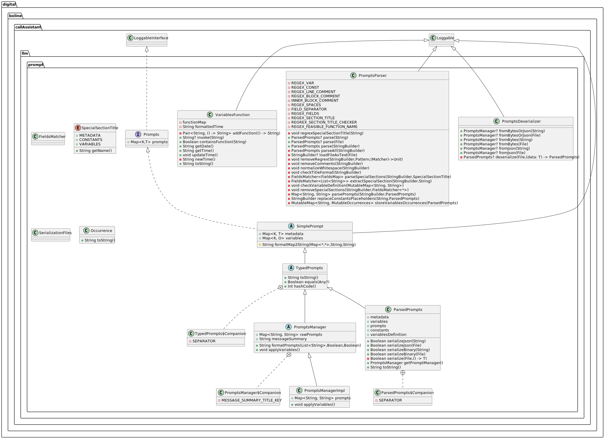

# LLM Prompts Management 

This package implements the management of prompts for an LLM model. It allows to write prompts based on a dedicate 
syntax, which can be parsed on a Kotlin map that can be used to guide the instructions for an LLM model.


## Package Structure

It is base on the following files
 - [PromptsParser.kt](../../src/main/kotlin/digital/boline/callAssistant/llm/prompt/PromptsParser.kt), which implements the instruction for parsing the prompts syntax and generate 
   Kotlin maps based on the `PromptsParser` class. The latter exposes the `parse()` method, which return instances of
   the `ParsedPrompts` object.
 - [PromptsUtils.kt](../../src/main/kotlin/digital/boline/callAssistant/llm/prompt/PromptsUtils.kt), which implements some helper functions for prompts management, such as the 
   `ParsedPrompts`, `PromptsDeserializer` and related structures: `Occorrence`, and list of `Occurrences`.
 - [PromptsManager.kt](../../src/main/kotlin/digital/boline/callAssistant/llm/prompt/PromptsManager.kt), which implements the kotlin maps to be used at runtime for exploiting 
   prompts. It encompasses the `Prompts` interface, and the `SimplePrompts`, and `ApplicablePrompts` abstract classes 
   for generality. Also, it implements the `PromptsManager` and the `VariablesFunction`, which are the objects used at 
   runtime.
 - [PromptsValidator.kt](../../src/main/kotlin/digital/boline/callAssistant/llm/prompt/PromptsValidator.kt), which implements a running function that allow checking prompt syntax, 
   and serialize their results for an efficient usage at run time.


## Workflow

The package is designed to be used by following these steps:
 1. Write a prompt following the syntax explained below,
 2. Use the validator to serialize the syntax as byte in to a file.
 3. At runtime deserialize the syntax, and use the prompts' data.

This is done to optimize the performances since the parsing process can be time-consuming, even if it could have been 
further optimized. In particular, along with this workflow, the Kotlin classes and objects involved are the following.

`PromptsParser.parse()` takes a file where the prompts are defined through the specific syntax, and returns an instance 
of `ParsedPrompts` class. The latter encode data related to prompts (i.e., metadata, constants, variables, and prompts 
section) in a mutable form. In addition, `ParsedPrompts` allows serializing and deserializing data into a file, while 
the `PromptDeserializer` object is in charge to load such a data at run time. The points 1 and 2 of the workflow above 
are done offline, and they can be done through the `PromptsValidator` object while interacting with the terminal.

At run time, `PromptDeserializer` loads data generate with the `PromptsValidator`, and returns an instance of 
`PromptsManager`. The latter encodes not mutable data, and it is in charge to fill the prompts with variables values. 
The `PromptsManager` can be used at run time to guide the LLM model.


## The Prompts Syntax

The `PromptsParser` accepts either a file path or a raw text string as input. The input text must adhere to a specific 
syntax that defines **titles** and **sections**:

 - **Titles**:   are identified by the `\n__ ... __\n` syntax.
 - **Sections**: are the content immediately following a title. 

Note that at least one section must be present for the syntax to be valid. There are two possible types of sections:

 1. **Special Sections** are denoted by `\n__* ... *__\n` titles, and contain a list of key-value pairs (called 
    **fields**) with the ` - field key = field value\n` syntax. There are three possible types of special section, i.e.,
    1. **Metadata**:  Used for auxiliary purposes like versioning or logging. Fields in this section are generally not 
       programmatically processed as far as prompts data is concerned. An exception is the `*MessageSummaryTitle*`
       field, which value is used while formatting the prompts for the LLM model. Such a value would be the title of a
       section containing the summary of previous messages exchanged between the user and the assistant. For more 
       information of such a summarization process see the [`message` package documentation](../wiky/LLM_MESSAGE-README).
    2. **Constants**: Represent fixed string values that can be referenced in other sections during parsing, enabling 
       prompt parameterization.
    3. **Variables**: Represent dynamic string values generated at runtime. Each variable must be associated with a 
       Kotlin function that:
       * Is defined in the `VariablesFunction` class.
       * Takes no input parameters.
       * Returns a string that will replace the variable's placeholder at runtime.

 2. **Prompt Sections** are denoted by `\n__ ... __\n` title (without asterisks). They contain the textual content sent 
    as prompts to the LLM. They can reference constants and variables by using a **placeholder** denoted with the
    `{{field key}}` syntax. Note that constants' placeholders are replaced at parsing time, while variables at runtime 
    by evaluating the relative Kotlin functions.

**Note**: In the current implementation. fields cannot be recursively recalled. In other therms, is not possible to 
          define `my field key = {{another field key}}`.


### Text Cleaning and Token Minimization:

The parser performs various text-cleaning operations to minimize the token count in the final prompts. These include:
- Allowing multiple leading whitespaces or tabs at the beginning of a line (to preserve indentation), but removing 
  consecutive whitespaces and tabs elsewhere.
- Ensuring no more than one consecutive blank line just for paragraph division.
- Supporting C-style comments (`//` and `/* ... */`).  
  **Note:** Nested block comments are not supported, and their usage will result in an error.


### Handling Duplicates:

If some sections share the same name, they will be merged and
 - if they are *special section*, then the relative fields will belong to the same type (i.e., constant or variable). 
   However, if fields share the same `field key`, the value of the first field occurring in the syntax will be 
   overwritten with the value occurring next.
 - if they are *prompt section*, then their contents will be concatenated and separated by a blank line.

### Error Handling:

While this implementation logs errors and warnings for edge cases (e.g., unsupported syntax or invalid comments), it 
does not interfere with the computation. The goal is to robustly handle input parsing without breaking the computation. 
However, the developer is in charge to be sure that no error (and severe warning) occur.

### Prompts Syntax Example:

Below is an example of input syntax that the `PromptsParser` can process:

```
/* SPECIAL SECTIONS AND FIELDS  */

__* Meta *__ // Metadata section
// Metadata for versioning or auxiliary information
- version = 1.0
- application name = Call Assistant
- environment = test

// This metadata will be programatically used.
- *MessageSummaryTitle* = Previous Dialogue  


__* Const *__
// Constants section for reusable string definitions
- name = Mrs. Mario
- last name = Rossi


__* Var *__
// Variables section for runtime-generated values
- today = getDate
- now = getTime


/* PROMPT SECTIONS  */

__ Context __
Nowadays, spam callers are getting better and better.
The time is {{today}} at {{now}}.


__ Role __
You are the assistant of {{name}} {{last name}}, and 
you need to answer the phone when he is busy.


__ Action __
  1. Ask for the reason for the call.
  2. Ask for a phone number to eventually call back 
     the person who called {{name}}.
```

When parsed, the above input can be mapped in the following Kotlin structures into the `ParserManager` object used at 
runtime, and serialized/deserialized into files.

```python
PromptsManger.metadata = { # Map<String, String>
    "version": "1.0",
    "application name": "Call Assistant",
    "environment": "test",
    "*MessageSummaryTitle*": "Previous Dialogue"
}
```
```python
PromptsManger.varibales = { # Map<String, Occurrences>, which is equivalent to: Map<String, List<Occurrence>>
    "Context": [
        {"functionName": "getDate", "indexStart": 67,  "indexEnd": 75 },
        {"functionName": "getTime", "indexStart": 82,  "indexEnd": 90 }
    ],
    "Role": [
        {"functionName": "getDate", "indexStart": 101, "indexEnd": 109}
    ]
}
```
```python
PromptsManger.prompts = { # Map<String, String>
    "Context": "Nowadays, spam callers are getting better and better.\n\nThe time is the 26 February 2025 at 14:40:01.",
    "Role": "You are the assistant of Mrs. Mario Rossi, and you need to answer the phone when he is busy.",
    "Action": "  1. Ask for the reason for the call.\n  2. Ask for a phone number to eventually call back\n" +
              "     the person who called Mrs. Mario."
}
```

Note that `prompts` data structure has variables placeholder replaced by the function `PromptsManager.applyVariables()`, 
which runs at constructor time, but it is possible to re-run it later if necessary (e.g., if the time or data should be 
updated). Remember that these structures are immutable at runtime except for the `applyVariable` mechanism.

On the other hand, at parsing time, the `metadata` and `variables` data structures above are stored on mutable HashMaps 
encoded in the `ParsedPrompts` class as done for the `PromptsManager`. The `ParsedPrompts` class also encompasses the 
`constants` and `variableDefinition` below. Note that the `ParsedPrompts` class has a different representation of 
`prompts` with respect to the `PromptsManger`. Nonetheless, the `prompts` structure below is encoded in the 
`PromptsManger` with the name `rawPrompts`.

```python
ParsedPrompts.constants = { # Map<String, String>
    "name": "Mrs. Mario",
    "last name": "Rossi"
}
```
```python
ParsedPrompts.variableDefinition = { # Map<String, String>
    "today": "getDate",
    "now": "getTime"
}
```
```python
ParsedPrompts.prompts = { # Map<String, String>
    "Context": "Nowadays, spam callers are getting better and better.\n\nThe time is the {{today}} at {{now}}.",
    "Role": "You are the assistant of Mrs. Mario Rossi, and you need to answer the phone when he is busy.",
    "Action": "  1. Ask for the reason for the call.\n  2. Ask for a phone number to eventually call back\n" + 
              "     the person who called Mrs. Mario."
}
```

## How to define a new Variable Function

To define new Kotlin functions that can be used to define custom variables on special section (e.g., as `getTime` and 
`getData`), you should: 
 1. implement the function into the `VariablesFunction` object, and 
 2. add your implementation to the functions map in `VariablesFunction`. 
The `VariablesFunction` object is available at the 
[PromptsManagerImpl.kt](../../src/main/kotlin/digital/boline/callAssistant/llm/prompt/PromptsManager.kt) file.

For example, Let us assume you want to implement a function `myFunc`, which can be used within the prompts syntax as:
```
__* Var *__
 - my function: myFunc
 
__ Title __
A section using {{my function}}.
```

Then, you should modify the `VariablesFunction` object such to include your function implementation as
```kotlin
fun myFunc(): String {
    // TOD implement it...

    // The returned string will replace the '{{my function}}' syntax.
    return "a string"  
}
```
Note that the name of the function is exactly the same as the field value used in the special section `__* Var *__`.

Then, you need to add your implementation to the map of functions manage by `VariablesFunction` by modifying the 
definition of `functionMap` as:
```kotlin
private val functionMap = mapOf(
        addFunction(::getTime),
        addFunction(::getDate),
        // ...

        // Add your funtion to the list already available.
        addFunction(::myFunc) 
    )
```
Finally, remember to update the documentation as well.

## API Usage

To parse a prompt syntax, and work with the data offline before serialize it into file, you can use these API:
```kotlin
// Parse from file.
val promptsFilePath = "..."
val parsed: ParsedPrompts? = PromptsParser.parse(promptsFilePath)

/*// Alternatively, parse from a string directly. 
val prompts: StringBuilder = "..."
val parsed: ParsedPrompts = PromptsParser.parse(prompts)
*/

// Access mutable parsed data.
val metadata: MutableMap<String, String>? = parsed?.metadata
val constants: MutableMap<String, String>? = parsed?.constants
val variablesDefinition: MutableMap<String, String>? = parsed?.variablesDefinition
val variablesOccurrences: MutableMap<String, Occurrences>? = parsed?.variables
val prompts: MutableMap<String, String>? = parsed?.prompts
// val manger: PromptsManager? = parsed?.getPromptManager() // Not recommended, use deserialization instead.

// Serialize into JSON file for human readability on developing.
val serializedFilePathJson = "..."
parsed.serializeJson(serializedFilePathJson)

// Serialize into Bynary file to improve performance on production.
val serializedFilePathBytes = "..."
parsed.serializeBinary(serializedFilePathBytes)
```

To use parsed data prompt at runtime wou should use:
```kotlin
// Deserialized from Binary file.
val serializedFilePathBytes = "..." // The same file as in the example above.
val manager?: PromptsManager = PromptsDeserializer.fromBytes(serializedFilePathBytes)
        
/* //Alternatively, deserialize form Json file.
val serializedFilePathJson = "..." // The same file as in the example above.
val manager: PromptsManager = PromptsDeserializer.fromJson(serializedFilePathJson)
 */

// Access data
val prompts: Map<String, String>? = promptsManager?.prompts

// Eventually, update variables values on prompts.
manager?.applayVariables()

// Assign message sommarization from given from the `MessagesManager`.
manager.messageSummary = "Previously the user asked for help."

// Format the system prompt to be given to the LLM model.
val promptForLLM = manager.formatPrompts(listOf("Action","Context"),
                                             includeTitle = true, 
                                             includeSummary = true)
```
In this case, `promptForLLM` would be as: 
```
**Action:**
  1. Ask for the reason of the call.
  2. Ask for a phone number to eventually call back who
     called Mrs. Mario.

**Context:**
Nowadays, spam caller are getting better and better.

Now is the 19/03/2025 at 02:19:27.

**Previous Dialogue:**
Previously the user asked for help.
```
Note that the `Previous Dialogue` title has been specified through the `*MessageSummaryTitle*` fields provided in the 
metadata section, while the related section is given at runtime by the LLM model itself, and the `MessageManager`
class. For more info about the summarization process see the [`message` package documentation](../wiky/LLM_MESSAGE-README).


For more examples about the prompt syntax and related API, see the
[PromptsParserTest.kt](../../src/test/kotlin/digital/boline/callAssistant/llm/prompt/PromptsParserTest.kt)
or the [PromptsValidator.ky](../../src/main/kotlin/digital/boline/callAssistant/llm/prompt/PromptsValidator.kt) files. The former is a Unit-Test implementation of the prompts-related
implementation. The latter can be used to perform parsing, validating and serializing prompts while interacting through
the terminal, and it has been designed to cover all the operation that should be done offline.

### Architecture:

Here it follows the UML Class diagram of the classes implemented in the [prompt]() package, for a more detailed check 
the [code documentation](../dokka/html/-call-assistant--brain/digital.boline.callAssistant.llm.prompt/index.html).




---

**Author** Luca Buoncompagni.  
© 2025.