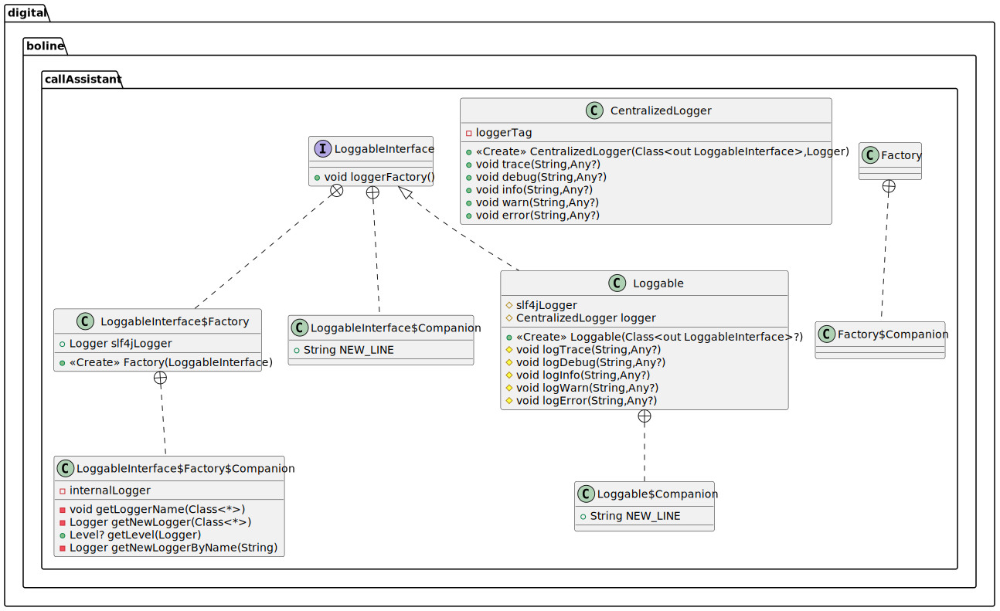

# Loggable Facilities

The [Loggable.kt](../../src/main/kotlin/cubibon/callAssistant/Loggable.kt) file contains all the interfaces and
class that provides logging facilities to this project in a general manner. The file implements the `LoggableInterface`
and the `Loggable` class. The latter class can be implemented by any class to inherit logging ability, while the former
should be used if a class already implements another class; since a class cannot extend two classes, e.g., it might 
already extend another class due to a third parts library. Both the `LoggableInterface` and `Loggable` class are 
designed to provide a unified, general, but yet simple implementation of logging facilities.

Logging is based on `org.apache.logging.log4j.Logger` bridged through `org.slf4j.LoggerFactory`, which assures 
asynchronous logging behaviour, and it is the recommended implementation for AWS lambda functions. Such a loggers are
configured through the [log4j2.xml](../../src/main/resources/log4j2.xml) file. Also, the logging is designed through 
different logger that has a name, which is automatically set equal to the name of the package in which a specific class 
is implemented. In thi way, it is possible to set the logging level (i.e., `TRACE`, `DEBUG`, `INFO`, `WARN`, `ERROR`) of 
each package, and they can be set the through environmental variables defined by the
[log_config.env](../../src/main/resources/log_config.env) file. See also [build.gradle](../../build.gradle.kts) and 
[README](../../README.md) for more information on environmental variable.


## Loggable Implementation

The minimal implementation of the `LoggerInterface` is
```kotlin
class MyClass : LoggableInterface, AnotherClass() {
    protected val logger = CentralizedLogger(this.javaClass, loggerFactory())

    // Use here functions like: `logTrace()`, `logDebug()`, `logInfo()`, `logWarn()`, `logError()`.
}
```
This is enough to inherit all logging facilities, configuration and encapsulation. 

However, when it is possible it is recommended to use the `Loggable` class, which also provides a centralized logging 
managing, since all logs can be intercepted from the same function. In this case is enough to set
```kotlin
class MyClass : Logger() {
    // Use here functions like: `logTrace(...)`, `logDebug(...)`, `logInfo(...)`, `logWarn(...)`, `logError(...)`.    
}
```
Note that you can always pass `this.logger` ti another class for sharing logging facilities.

If the logging facilities should be exploited by a companion object you can use the same approach as before, but we
recommend to also set the logger name (otherwise the `Companion` tag will be used in the log, which can be confused
among different objects). To do so use
```kotlin
    ...
    companion object: Loggable(MyClass::class.java) {
        // Use here functions like: `logTrace(...)`, `logDebug(...)`, `logInfo(...)`, `logWarn(...)`, `logError(...)`.
    }
    ...
```

A similar approach can be used if an interface needs logging facilities, for instance:
```kotlin
interface MyInterface: LoggableInterface {
    
    fun foo() {
        logTrace("foo") // Or `logTrace(...)`, `logDebug(...)`, `logInfo(...)`, `logWarn(...)`, `logError(...)`.
    }
    
    companion object: Loggable(MyInterface::class.java) {
        private val log = this.logger
    }
}
```

Note that logging function accepts an input string, with a list of `Any` argument. For instance, you can use:
```kotlin
  this.logInfo("A message. Do not use string concatenation here!")
  this.logInfo("A message concatenate with data structures {} {} efficiently", anyObject1, anyObject2)
  this.logInfo("A message with data structures {} {} and a throwable", anyObject1, anyObject2, throwable)
```
Where the arguments are:
 1. A message string with possible template parameters expressed as `{}`.
 2. A list of objects that have been parametrized in the message. This allows efficient string concatenation without
    creating copies string, and without the possibility to lose time generating a log that might never be printed due
    to a low logging level.
 3. Eventually, a throwable that is used to log the related error message, cause and stacktrace. The throwable must be 
    the last element of the object list (introduced in the previous point), and the number of template parameter `{}`
    should not include the throwable itself.

## Software Architecture 

The following image show the implemented architecture for the loggable facilities. For more, see the 
[documented code](../dokka/html/-call-assistant--brain/cubibon.callAssistant/index.html).



---

**Author** Luca Buoncompagni.  
© 2025.