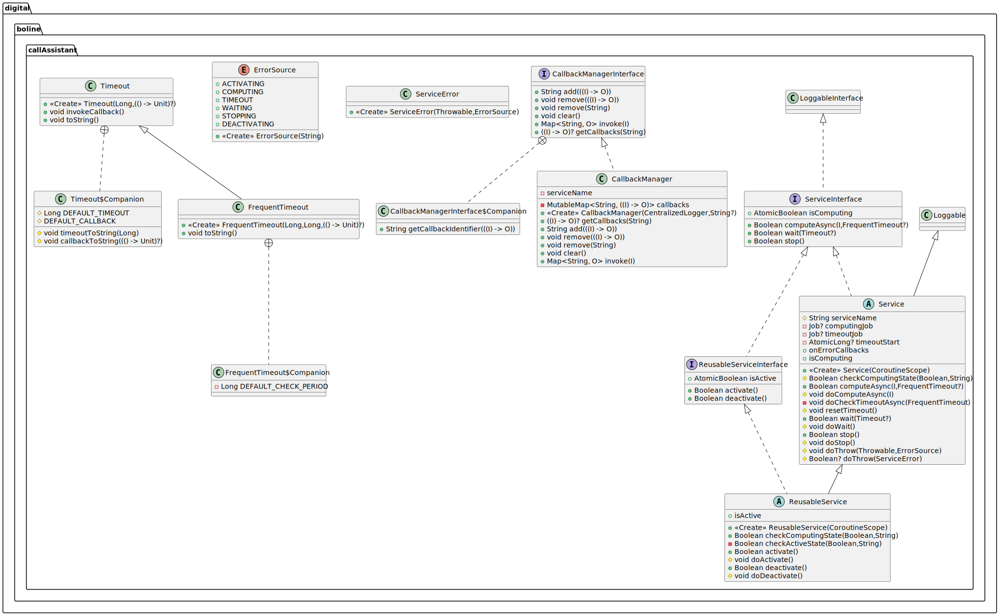

# Service Interface

The service interface is the base implementation for asynchronous services like `Speech2Text`, `Text2Speech`, and
`LlmIteract`, which might relative implementation for different provider, e.g., AWS. Its main purpose is to provide
common design patterns and implementations for:
 - the management of the state of a service, such as the `isComputing`, and `isActive`,
 - common exception handling, and logging facilities (based on the `LoggableInterface`)
 - the implementation of optional timeouts and callbacks.

The implementation of asynchronous services is based on Kotlin coroutines.

## Software Architecture 

The image below shows the software architecture that encompasses
 - `ServiceInterface<I>`, which defines the main functionality of a service, i.e., `computeAsync`, `wait` and `stop`, as
   well as the `isComputing` state as a flag that is `true` when the service is computing. Note that `computeAsync`, and
   `wait` allow to specify a timeout as addressed below. Also, `I` is the type of data to be provided to `computeAsync`.
 - `Service<I>` is an abstract class the provides common implementation based on the `ServiceInterface`. This class 
   provides common implementation and delegates the implementation of service logic to the `doComputeAsync`, `doWait`,
   `doStop`, `doThrow` abstract internal methods (see in the following sections for more information about `Service`).  
   Also, this class requires the following data classes.
    - `TimeOut` is a data class that specify the timeout for the `wait` method, and it allows defining a callback.
    - `FrequentTimeout` is an extension of `Timeout`, and it is used by `computeAsync`. This class allow resetting the 
      timeout such to augment the time interval when some events occur, e.g., some data has arrived even if it is not
      the final service result.
    - `ServiceError` is a data class used to propagate exception through callbacks, and it encodes an instance of the 
      `ErrorSource` enumerator that represent in which method the exception occurred (see below for more detail).
 - `ReusableServiceInterface<I>` is an extension of `ServiceInterface<I>` that includes the `activate` and `deactivate`
   methods, as well as the `isActive` service state, which are used to initialize and release the resources need by the 
   service. 
 - `ReusableService<I>` is an abstract class that implements`ReusableServiceInterface<I>` and extends `Service<I>`. It 
   is designed to allow opening and closing WEB clients only once, while have the possibility to perform several 
   computation with `computeAsync`. Similarly to above, it implements common features and delegates the logic to the 
   `doActivate` and `doDeactivate` abstract internal method (see below for more information).
 - `CallbackManagerInterface<I,O>` defines an object that encodes a map of callbacks. Each callback requires an input 
   parameter of type `I`, and provides an output valur of type `O`. Within this map callbacks can be added, removed, and
   invoked.
 - `CallbackManager<I,O>` define an implementation of `CallbackManagerInterface<I,O>`, that store callback on a map with
   a string identifier associated with the location where such callback function are stored.



### Service Behaviour and Interface

#### Service State

The `Service<I>` abstract class is implemented such to allow only one asynchronous computation at a time, i.e.,
`computeAsync` runs only if `isComputing` is `false` (and if `computeAsync` is not allow to run it returns `false`).  
When the service `isComputing` it is possible to `wait` for its computation to finish o `stop` it explicitly. Note that 
the `Service<I>` requires a Kotlin coroutine scope at construction time, which specify the thread pool from
where all the asynchronous job will run.

#### Timeout

The `computeAsync` method allow the definition of a timeout with a callback that will be invoked if the timeout occur.
Also, `computeAsync` allow using the `resetTimeout` method that restart the process of counting time interval before to
trigger a timeout. For allowing this behaviour, `computeAsync` might run two paired jobs: one that actually make 
computation, and another that only check if the timeout expired (the former is `computingJob`, the latter is 
`timeoutJob`). Furthermore, also the `wait` method allow the definition of an optional timeout with a relative callback, 
but in this case, the timeout cannot be reset.

#### Callbacks and Exception Handling

Depending on the specific implementation of a `Service`, the result are obtained through a `CallbackManager` when the
`computeAsync` terminates its job. On the other hand, if an exception occurs, the callbacks stored in the 
`onErrorCallbacks` (which is of type `CallbackManager<ServiceError, Unit>`) will be invoked. Such callbacks do not 
produce any outputs, and receive as input the `Throwable` related to the exception and the `ErrorSource` enumerator.
Such enumerator is 
 - `COMPUTING`, if the error occurred in the `computingJob` launched by `computeAsync`.
 - `TIMEOUT`, if the error occurred in the `timeoutJob` launched by `computeAsync`.
 - `WAITING`, if the error occurred in the `wait` method.
 - `STOPPING`, if the error occurred in the `stop` method.

Note that the exception handling is implemented by the `doThrow` method, which can be customized. Nonetheless, it is 
always possible to catch for a particular exception but, in this case, we suggest throwing back the exception such to 
propagate that exception to the callbacks stored in `onErrorCallbacks`. 

#### Service Implementation

In other to achieve such a behaviour, the developer need to design a concrete class that extends the abstract class
`Service<I>`. Such a concrete class should only focus on implementing resource initialization and computation logic 
since all the other aspects hare managed by `Service<I>` (i.e., service state, logging, exception handling, timeout and
callback definition). 

In particular, the developer need to implement `doComputeAsync`, which runs within the `computingJob`, and a try-catch
block related to `ErrorSource.COMPUTING`. This method is the one that actually run the service for getting some results.
Typically, the results should be provided back to the class that required ti through a `CallbackManager<I,O>`.  

Also, the developer might want to override the `doWait` and `doStop` method based on the current implementation of the
`doComputeAsync`. However, in this case, is always important to also invoke the super implementation, i.e., 
`super.doWait()`, `super.doStop`

Note that these method are accessible from the server usage, but they are internally used by `computeAsync`, `wait`, and 
`stop` respectively.

### Service Usage

Here it follows an example of how to define a class that extends `Service<I>` and use it.

```kotlin
class MyService: Service<String>(myScope){
    val onResultCallback = CallbackManager<String, Unit>(logger)

    init {
        setLoggingLevel(Level.INFO)
    }

    override suspend fun doComputeAsync(input: String) {
        // perform some computation here.
        delay(1000)
        val output = "\"$input\""
        println("computation done!")
        // Propagate the result to the callback.
        onResultCallback.invoke(output)
    }

    override fun doStop() {
        // If necessary, stop here the jobs that have been started on `doComputeAsync`.
        super.doStop()
    }

    override suspend fun doWait() {
        // If necessary, wait here for the jobs that have been started on `doComputeAsync`.
        super.doWait()
    }

    companion object {
        private val myScope = CoroutineScope(
            SupervisorJob() + Dispatchers.Default + CoroutineName("myScope")
        )
    }
}
```

```kotlin
suspend fun main() {
    // Construct a new service
    val myService = MyService()

    // Initialize Callbacks
    myService.onErrorCallbacks.add { error: ServiceError ->
        println("Error (${error.source}): ${error.throwable}")
    }
    myService.onResultCallback.add { result: String ->
        println("Result: $result")
    }

    println("------------------------------")
    
    // Perform some computation. Note that timeout is optional.
    val computingTimeout = FrequentTimeout(2000, 100) {
        println("Computation went on timeout.")
    }
    myService.computeAsync("Servicing fist request.", computingTimeout)

    // Wait for the computation to finish. Note that the timeout is optional.
    val waitingTimeout = Timeout(2000) {
        println("Waiting went on timeout.")
    }
    myService.wait(waitingTimeout)

    println("------------------------------")

    // Perform another computation.
    myService.computeAsync("Servicing second request.")

    // Stop the computation
    myService.stop()
}
```


### ReusableService Behaviour and Interface

The `ReusableService<I>` extends the functionalities of `Service<I>` with a higher level state, i.e., `isActive`. Such
a state becomes `true` by calling the `activate` method, and is reset through the `deactivate` method. These methods 
should open and close service's resources, e.g., a web client or data stream. Then the `computeAsync` method can be
reused multiple time to reduce instantiation latency. When `isCompute=true` a reusable service cannot be neither 
activate nor deactivate. Similarly, if a reusable service is not activate it is not allow to perform `computeAsync`.  

The `ReusableService<I>` have the same behaviour of a `Service<I>`, but it exploits two more `ErrorSource` in case of
an exception, i.e.:
- `ACTIVATING`, if the error occurred in the `activate` method.
- `DEACTIVATING`, if the error occurred in the `deactivate` method.

A class that extends `ReusableService<I>` needs to implement the `doActivate` and `doDeactivate` functions that are 
called by `activate` and `deactivate` respectively.

### ReusableService Usage

Here it follows an example of how to define a class that extends `ReusableService<I>` and use it.

```kotlin
lass MyReusableService: ReusableService<String>(myScope){
    val onResultCallback = CallbackManager<String, Unit>(logger)

    init {
        setLoggingLevel(Level.INFO)
    }

    override fun doActivate() {
        println("Initializing service resources.")
    }

    override suspend fun doComputeAsync(input: String) {
        // perform some computation here.
        delay(1000)
        val output = "\"$input\""
        println("computation done!")
        // Propagate the result to the callback.
        onResultCallback.invoke(output)
    }

    override fun doStop() {
        // If necessary, stop here the jobs that have been started on `doComputeAsync`.
        super.doStop()
    }

    override suspend fun doWait() {
        // If necessary, wait here for the jobs that have been started on `doComputeAsync`.
        super.doWait()
    }

    override fun doDeactivate() {
        println("Releasing service resources.")
    }

    companion object {
        private val myScope = CoroutineScope(
            SupervisorJob() + Dispatchers.Default + CoroutineName("myScope")
        )
    }
}
```

```kotlin
suspend fun main() {
    // Construct a new service
    val myReusableService = MyReusableService()

    // Initialize Callbacks
    myReusableService.onErrorCallbacks.add { error: ServiceError ->
        println("Error (${error.source}): ${error.throwable}")
    }
    myReusableService.onResultCallback.add { result: String ->
        println("Result: $result")
    }

    println("------------------------------")

    // Activate the service
    myReusableService.activate()

    // Perform some computation. Note that timeout is optional.
    val computingTimeout = FrequentTimeout(2000, 100) {
        println("Computation went on timeout.")
    }
    myReusableService.computeAsync("Servicing fist request.", computingTimeout)

    // Wait for the computation to finish. Note that the timeout is optional.
    val waitingTimeout = Timeout(2000) {
        println("Waiting went on timeout.")
    }
    myReusableService.wait(waitingTimeout)

    println("------------------------------")

    // Perform another computation.
    myReusableService.computeAsync("Servicing second request.")

    // Stop the computation
    myReusableService.stop()

    // Deactivate the service
    myReusableService.deactivate()

    // You might want to activate the service again and perform some other computation...
}
```
For more implementation details check out the 
[documented code](../dokka/html/-call-assistant--brain/digital.boline.callAssistant/index.html).

For more examples checkout
 - [ServiceInterfaceTest](../../src/test/kotlin/digital/boline/callAssistant/ServiceInterfaceTest.kt)
 - [DummyText2Speech](../../src/test/kotlin/digital/boline/callAssistant/text2speech/DummyText2Speech.kt)
 - [DummySpeech2Text](../../src/test/kotlin/digital/boline/callAssistant/speech2text/DummySpeech2Text.kt)
 - [DummyLlmInteract](../../src/test/kotlin/digital/boline/callAssistant/llm/DummyLlmInteract.kt)

---

**Author** Luca Buoncompagni.  
© 2025.