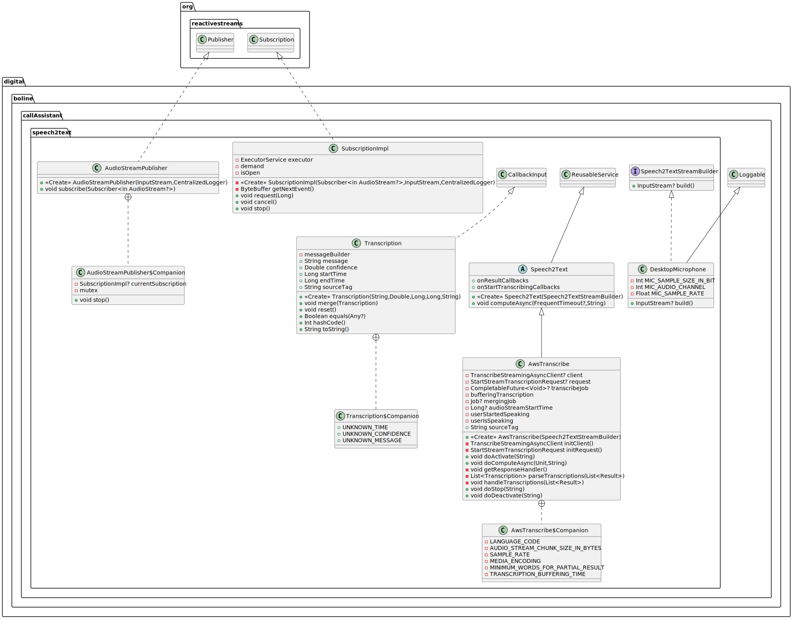

# Speech to Text

The text-to-speech service exploits the [Service Interface](SERVICE) to provide asynchronous usage of a
WEB-based provider for transforming audio stream into a text. As an example, we provide an implementation based on
the AWS Transcribe service.

## Software Architecture

As shown in the UML diagram below, the speech-to-text process in based on the `Speech2Text` abstract class, which
extends the `ResusableService<Unit>` with a `computeAsync` method that bridge a real-time audio stream to the 
speech-to-text service provider without taking any input parameters. 

`Speech2Text` provides an `onResultCallbacks` that will be invoked when some audio has been translated into a text. 
Furthermore, when the user start speaking, the `onStartTranscribingCallbacks` are invoked, while when a final 
transcription of the audio is obtained, then the `onResultCallbacks` is invoked.

The `Speech2Text` class requires a `Speech2TextStreamBuilder`, which is in charge to open the audio stream for the
speech-to-text service provider. An example of stream builder based on the microphone is `DesktopMicrophone`.

## AWS Speech To Text

We provide and implementation based on the AWS Streaming Transcribe service into `AwsTranscribe`. This service handle a
real time audio stream based on the `AudioStreamPublisher`, which uses `SubscriptionImpl`. The latter buffer audio 
signal in a separate thread, while the former bridge such a signal with an AWS-based client. In this case, we do not use
the service interface based on coroutine, but threads, to assure real time processing and parallelism. 

`AwsTranscribe` requires these environmental variables (see the [README](../../README.md) for more info about 
environmental variables): `AWS_TRANSCRIBE_LANGUAGE`, `AWS_TRANSCRIBE_AUDIO_STREAM_CHUNK_SIZE`, `AWS_REGION`, 
`AWS_ACCESS_KEY_ID`, `AWS_SECRET_ACCESS_KEY`, and `AWS_SESSION_TOKEN`.

`AwsTranscribe` invokes the `onStartTranscribingCallbacks` when a `partial` audio transcription exceed the limit of a
certain number of words. Such a mechanisms allows to efficient react in the case the user is interrupting the 
LLM-based assistant. Also, `AwsTranscribe` invokes the `onResultCallbacks` when a final audio transcription is obtained 
and the user does not speak for a certain amount of time (i.e., no `partial` transcriptions are obtained within such 
interval of time). This should avoid invoking the callback with a final transcription while the user is still speaking.

An example of how to use this service is:

```kotlin
      // Instantiate the service with the ability to read `InputStream` from the microphone.
      val transcriber = AwsTranscribe (DesktopMicrophone)

      // Set the callback invoked when a not partial transcription has been provided by AWS Transcribe
      transcriber.onResultCallbacks.add { result: Transcription ->
          println("Callback -> $result")
      }

      // Set the callback invoked when the user started speaking.
      transcriber.onStartTranscribingCallbacks.add { 
          println("The user started speaking!")
      }

      // Set the callback invoked when an error occurred.
      transcriber.onErrorCallbacks.add { se: ServiceError ->
          println("Error during transcription: ('${se.source}', ${se.sourceTag}) ${se.throwable.message}")
      }

      // Initialize the AWS Transcribe resources.
      transcriber.activate()

      // Define the timeout with its callback
      val timeoutSpec = FrequentTimeout(timeout = 5000, checkPeriod = 50) { sourceTag ->
          println("Computation timeout reached! ($sourceTag)") // This is called when timeout occurs.
         // Note that this timeout is reset  everytime some audio is converted into text.
      }

      // Start asynchronous listener for the microphone (the timeout and sourceTag are optional).
      transcriber.computeAsync(timeoutSpec, "MySourceTag")

      // Eventually, wait for the computation to finish (the timeout is optional).
      transcriber.wait(Timeout(timeout = 20000) { sourceTag ->
          println("Waiting timeout reached! ($sourceTag)")
      })

      // You might want to stop the transcription service.
      transcriber.stop()

      // Here you can use `computeAsync` again (together with `wait` or `stop`)...

      // Always remember to close the service resources.
      transcriber.deactivate()

      // You can re-activate the service and make more computation...

      // Cancel the scope and all related jobs. After this the service cannot be activated again.
      transcriber.cancelScope()
```




For more info see the [Service Interface](SERVICE).  
For more implementation details check out the
[documented code](../dokka/html/-call-assistant--brain/cubibon.callAssistant.speech2text/index.html).  
For more examples checkout
[DummySpeech2Text.kt](../../src/test/kotlin/cubibon/callAssistant/speech2text/DummySpeech2Text.kt) and
[AwsTranscribeRunner.kt](../../src/test/kotlin/cubibon/callAssistant/speech2text/AwsTranscribeRunner.kt).

---

**Author** Luca Buoncompagni.  
© 2025.