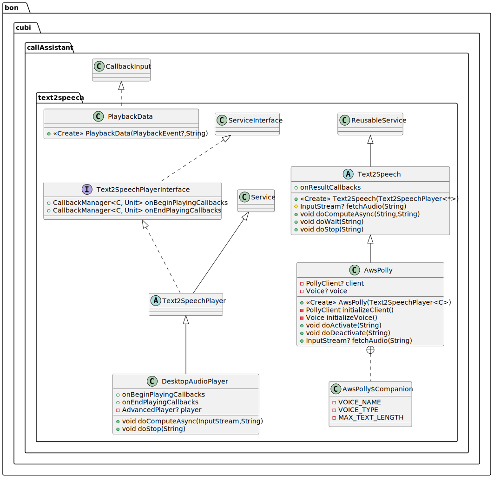

# Text To Speech

The text-to-speech service exploits the [Service Interface](SERVICE) to provide asynchronous usage of a 
WEB-based provider for transforming text into an audio stream. As an example, we provide an implementation based on 
the AWS Polly service.

## Software Architecture

As shown in the UML diagram below, the text-to-speech process in based on the `TextToSpeech` abstract class, which
extends the `ResusableService<String>` with a `computeAsync` method that involves two consecutive steps:
 1. `fetchAudio`: which uses AWS Polly to transform a string into an audio stream, 
 2. audio playing: which is based on an implementation of `Text2SpeechPlayerInterface` to play the converted text.

The `Text2SpeechPlayerInterface<C>` implements another `ServiceInterface<InputStream>` that defines callbacks invoked 
when the audio playing starts and finishes with `C` as input parameter. A simple implementation of the 
`Text2SpeechPlayerInterface<C>` is given by the `Text2SpeechPlayer<C>` abstract class. As an example, a concrete class
able to play the audio is `DesktopAudioPlayer`, which defines `C` as `PlaybackEvent` on the basis of 
`avazoom.jl.player.advanced.AdvancedPlayer`.

## AWS Text To Speech

This service requires the following environmental variables (see the [README](../../README.md) for more info about 
environmental variables): `AWS_POLLY_VOICE_NAME`, `AWS_POLLY_VOICE_TYPE`, `AWS_REGION`, `AWS_ACCESS_KEY_ID`, and
`AWS_SECRET_ACCESS_KEY`.

The implementation of a service able to leverage AWS services is `AwsPolly`, which can be used as:

```kotlin
     // Initialize the audio player.
     val player = DesktopAudioPlayer
     player.onEndPlayingCallbacks.add { event: PlaybackData ->
         println("End audio player callback: $event")
     }

     // Initialize the AWS Polly.
     val polly = AwsPolly(player)
     polly.onErrorCallbacks.add {se: ServiceError ->
         println("Error callback ('${se.source}', ${se.sourceTag}) ${se.throwable}")
     }

     // Initialize Polly's resources.
     polly.activate()

     // Use AWS Polly and manually stop it.
     polly.computeAsync("Hello")
     Thread.sleep(200)
     polly.stop()

     // Use AWS Polly with optional timeout, and sourceTag, which will be propagated to callbacks.
     val computingTimeout = FrequentTimeout(timeout = 20_000, checkPeriod = 200){ sourceTag -> 
         println("Polly computing timeout! ($sourceTag)")
     }
     val waitingTimeout = Timeout(timeout = 10_000) {
         println("Polly waiting timeout!")
     }
     polly.computeAsync("World.", computingTimeout, sourceTag = "MySourceTag")
     polly.wait(waitingTimeout)

     // Close Polly's resources
     polly.deactivate()

     // You might want to activate Polly again and perform some computation ...

     // Cancel the scope and all related jobs. After this the service cannot be activated again.
     polly.cancelScope()
```



For more info see the [Service Interface](SERVICE).  
For more implementation details check out the
[documented code](../dokka/html/-call-assistant--brain/digital.boline.callAssistant.text2speech/index.html).  
For more examples checkout
[DummyText2Speech.kt](../../src/test/kotlin/digital/boline/callAssistant/text2speech/DummyText2Speech.kt) and
[AwsPollyRunner.kt](../../src/test/kotlin/digital/boline/callAssistant/text2speech/AwsPollyRunner.kt).

---

**Author** Luca Buoncompagni.  
© 2025.